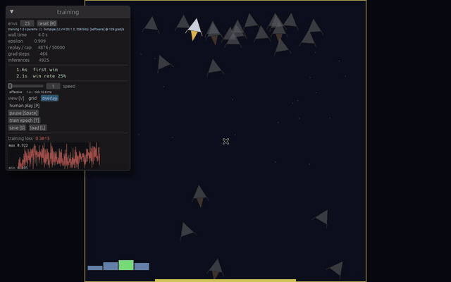

# mega-plays

Games where the opponents learn in real time, on your laptop's GPU, in Rust —
no CUDA, no Python.



*Twenty-five landers sharing one policy, from random weights to soft
touchdowns. Overlay view — every environment painted into the same
rect, the best current run opaque on top. Recorded on software Vulkan
(the slow case) and played back at 4× speed; the timestamps in the
milestone log are real.*

Showcase for [meganeura](https://github.com/kvark/meganeura) (GPU neural
network inference and training) and [blade-graphics](https://github.com/kvark/blade).
Every agent you see playing is training live: fresh-start on launch,
visibly improving inside a minute.

## Status

Three games. Each starts from random weights when you launch it and is
visibly better before you have finished reading the overlay.

Measured on an AMD 780M integrated GPU at the shipped defaults (25
parallel environments, one decision burst plus 8 gradient steps per
frame, auto-curriculum on), as the wall-clock time until the win rate
over the last 50 episodes first crosses the mark — see
`tests/curves.rs`:

| game | milestone | reached | difficulty after 60 s |
| --- | --- | --- | --- |
| **catch** — paddle under a falling ball | 50 % caught | **2.1 s** | 1.0× → **4.4×** |
| **pong** — against a scripted tracker | 50 % of points | **5.9 s** | 0.25× → **0.80×** |
| **lander** — soft touchdown on the pad | 20 % on-pad | **1.7 s** | 0.30× → **1.06×** |

The win rates do not keep climbing, and that is the point: once the
agent is beating the target W/L the auto-curriculum makes the game
harder instead, so the win rate sits near 60 % by design and the
**difficulty plot** is the progress curve. The lander starts on
training wheels — a wide pad and a forgiving touchdown — and reaches
its design specification about a minute in, still landing ~80 % of its
episodes. Catch, the easiest game here, ends the minute catching a ball
that falls four times faster than designed onto a paddle half the
width.

Each game is a separate binary (`cargo run --release --bin pong` /
`--bin lander` / `--bin catch`) over one shared library: same driver,
same DQN agent, same overlay, different `impl Game`.

## Building

```
cargo run --release --bin catch
```

Release mode is strongly preferred — debug throughput on the training
loop is not representative and the overlay stats will misread.

Meganeura and blade are both git dependencies pinned by SHA in
`Cargo.toml`. Bump them in lockstep, spelling the blade rev exactly the
way meganeura's manifest spells it: cargo keys a git source on the
literal rev string, so an abbreviated SHA and its full form are two
sources of the same commit, and two crate instances of the same FFI
type do not link.

To smoke-test headlessly (e.g. CI), install `mesa-vulkan-drivers` and
`xvfb`, then:

```
VK_ICD_FILENAMES=/usr/share/vulkan/icd.d/lvp_icd.json \
XDG_RUNTIME_DIR=/tmp/xdg \
RUST_LOG=mega_plays=info \
MEGAPLAYS_EXIT_AFTER_SECS=60 \
xvfb-run -s "-screen 0 1280x800x24" cargo run --release --bin pong
```

Logging is at the usual warnings-and-above by default;
`RUST_LOG=mega_plays=info` adds a two-second heartbeat and the
milestone log, which is how you follow a run with no window to look at.

`MEGA_HEADLESS=<frames>` skips the window entirely, which is the only
way to run on the real GPU on a machine without a display — Xvfb has no
DRI3, so a hardware Vulkan driver cannot present to it.

## Learning fast enough to watch

The engine is not the bottleneck. A gradient step on the ~1.5 k-parameter
policy costs about a millisecond, so the driver lands ~800 of them a
second while also running physics and drawing. What decides whether a
demo looks alive is everything around the gradient step, and all of it
is sized in seconds a person will sit through rather than in steps.
Every number below comes from `tests/curves.rs`, which budgets
wall-clock time instead of frames, because "does it visibly learn while
you watch" is a wall-clock question.

### n-step returns

`AgentConfig::n_step` (default 3) folds three consecutive decisions into
one replay entry: the reward is the discounted sum over them and the
bootstrap term carries γ³. The network gets real reward from further
ahead instead of trusting its own half-trained estimate for those steps.
Every game here pays out at the end of an episode, which is exactly
where one-step TD is slowest — against one-step returns this is worth
roughly a factor of two on pong and a factor of four on the lander.

### Schedules sized for a viewer

ε decays over 5 000 gradient steps and training starts once 1 000
transitions are in replay. At the driver's rate that is a warmup which
ends before the window has settled and a policy that is greedy inside
ten seconds. Textbook values (five and twenty times larger) spend most
of a demo on uniform-random flailing.

### Environments in parallel

25 of them. Stepping a game is a rounding error next to a gradient step,
one batched inference covers all of them, and each extra environment is
more *fresh* experience per gradient step — with a handful of envs the
agent draws hundreds of replay samples per new transition, which is
where a DQN starts memorising instead of learning. Time to pong's 50 %,
three seeds each: 9 envs 12.5 s, 16 envs 8.6 s, 32 envs 5.7 s. 25 keeps
the grid square and legible at 1280×800.

### Potential-based shaping

Every game pays out the *change* in a potential Φ rather than a
per-step penalty (Ng et al., 1999 — a difference of potentials cannot
reorder the optimal policy). The distinction is not academic: an
absolute per-step distance penalty makes time itself expensive, and in
the lander that made a long hover cost more than a crash, so the
cheapest way to stop losing points was to hit the ground.

### The goal has to be reachable by accident

The first question to ask of any game or reward change is what a
*random* policy reaches, which is what `curves.rs::random_baseline`
answers. The lander's answer was 994 touchdowns without a single soft
landing — 82 % of them failing the tilt *and* the speed check at once,
at a mean vertical speed of 1.37 against a 0.40 limit. Its positive
rewards were not rare, they were unreachable, so hovering until the time
limit really was the best policy available and every learner-side knob
failed the same way.

Both fixes are in the world rather than the learner. Attitude damping,
because nothing removed angular momentum and one RCS tap span the craft
forever. And a curriculum that opens the touchdown *tolerance*, not only
the pad width, so random play succeeds a couple of percent of the time
and there is something to bootstrap from; the controller tightens both
back to the design specification as the pad-rate climbs.

## Design choices

### Rendering goes through egui — no cosmic-text, no custom pipeline

Every on-screen element — paddles, ball, scores, stats, sparklines — is
an egui primitive. We do not compile our own WGSL shaders, do not run an
MSAA resolve pass, and do not depend on `cosmic-text`. Egui ships a
perfectly serviceable monospace font and tessellates rectangles with
anti-aliased edges. For tens of primitives per frame the tessellator is
invisible in profiles.

When a future game needs thousands of sprites per frame, add a sibling
crate with a direct Blade pipeline; the driver already owns the
`Arc<blade_graphics::Context>` needed to build one.

### One Blade context, shared between renderer and meganeura

`meganeura::Session::with_context(plan, Arc<Context>)` lets the driver
create the Blade context once and hand a clone to both the renderer's
egui painter and the training / inference sessions. Same device, same
queue, same memory allocator, no device-enumeration surprises.

### Single-threaded driver

Each frame advances physics in bursts of `action_repeat` substeps per
inference, runs minibatch gradient steps, then renders. Physics gets at
most half of `frame_budget_ms` and training the rest, so a slow machine
degrades into fewer substeps and fewer gradient steps rather than into a
beautiful demo that has quietly stopped learning. The overlay surfaces
the achieved sim multiplier, so the user can tell "slider is in the way"
from "machine is in the way".

A worker-thread split — moving the training session off the event loop
so render fps is independent of grad-step throughput — is sketched in
`AUDIT_PLAN.md`. Blade's Vulkan `Context` already guards its queue with
a `Mutex`, so the structural change is supported.

### `step()` is async; `wait()` before reading

Meganeura's `Session::step` submits GPU work but doesn't block. Reading
any buffer afterwards — inference outputs, training loss, parameters to
copy into a target snapshot — without an intervening `wait()` returns
whatever was in host-visible memory before the submission landed. The
failure mode is a policy that trains beautifully on stale Q-values, so
the rule is `step(); wait(); read_*(...)` everywhere meganeura's buffers
are consumed on the host.

### Real Double-DQN

The online network picks the action at the next state, the target
network evaluates its Q-value. Decoupling action selection from value
estimation kills the systematic positive bias of vanilla DQN
(`max_a Q'(s', a)` over a noisy Q' is biased above the true max); in
practice that's the difference between a run that holds its gains and
one that regresses late in training. Both networks live as CPU-side
weight snapshots — at this size a host-side forward pass is
sub-microsecond.

### Mask-based target fitting

The training graph feeds a one-hot action mask and a target Q value
scattered into the same action slot. The loss is plain MSE:

```
masked_q = q_all * action_mask
masked_t = target   * action_mask
loss     = mean((masked_q - masked_t)^2)
```

Only the column of `fc2` corresponding to the taken action receives
gradient. This avoids needing a gather op, which meganeura does not
currently expose. If / when gather lands we can switch to the more
standard Huber loss over a single Q-value.

### `done` vs `truncated` — episode boundaries that don't lie to bootstrap

`StepOutcome` carries both: `done` means the world reached an absorbing
state (Bellman target is cut, no bootstrap past it), `truncated` means
the env reset for management reasons — a time limit, an escape boundary
— and the bootstrap target survives. Both count as a finished, unwon
episode for the win rate and the curriculum, so an agent that settles
into stalling until the time limit shows up as one that stopped winning
instead of one whose win rate stopped updating.

## Controls

- `Space` — pause physics. **Training continues** so the network keeps
  chewing on what's already in replay.
- `G` — toggle the stats panel.
- `V` — switch between **grid** (one tile per env) and **overlay** (all
  envs painted into the same rect with alpha blending, the current
  best-performing env on top at full opacity). Super Meat Boy's replay
  screen is the visual reference.
- `P` — human play: arrow keys take over env 0's opponent.
- `R` — reset agent weights and replay buffer.
- `T` — run a 10 000-frame headless training epoch in chunks.
- `S` / `L` — save / load weights to `<game-title>.weights`.
- `Esc` — quit.

The training panel carries the milestone log (first win, win-rate
crossings, difficulty steps, timestamped), the loss and episode-return
curves, the instantaneous-reward sparkline, per-game sliders, the
auto-curriculum toggle and target W/L, the win-rate EMA against its
target, and difficulty over wall time.

## Environment variables

- `MEGAPLAYS_NUM_ENVS=<n>` — override `num_envs` at launch.
- `MEGAPLAYS_VIEW=overlay` — start in overlay view.
- `MEGAPLAYS_EXIT_AFTER_SECS=<n>` — self-exit after this wall time.
- `MEGAPLAYS_FORCE_EPSILON=<f>` — pin ε to this value (for tests).
- `MEGAPLAYS_SEED=<u64>` — seed every random stream in the process
  (network init, ε-greedy draws, replay sampling, and each game's own
  noise). Streams are handed out as `seed, seed+1, …` in construction
  order, so parallel environments still differ from each other while two
  runs of the same build compare like for like.
- `MEGA_HEADLESS=<frames>` — skip window/surface/render entirely, run
  `frames` ticks of the physics+training loop, exit. Logs rolling
  win-rate, outcome mix and loss EMA every 500 frames.
- `MEGA_TRACE=<path|off>` — Perfetto trace destination, off by default.
- `RUST_LOG=mega_plays=info` — heartbeat and milestone log. Standard
  `env_logger` syntax; the default is warnings and above.

## Candidates for the next game

A new game is one `impl Game` module under `src/games/` plus a thin
`src/bin/<name>.rs` that wires it into [`run`]. What we look for is the
shortest possible feedback loop: something that converges in well under
a minute on a modest laptop GPU, keeps the observation flat and ≤ ~16
floats, and produces an on-screen policy the viewer can *see* getting
better.

1. **Grid-based find-the-food.** 8×8 grid, agent + food glyph, 4
   directional actions. Trivial physics, classic RL benchmark, benefits
   directly from the vectorised-env pipeline.
2. **Flappy-pipe.** Agent with gravity + one "flap" action, pipes scroll
   in. Episodes end on hit. Famous for being almost trivial with the
   right reward shaping and catastrophic without it — a good stress test
   for the harness's stability knobs.
3. **Simple arena-dodger.** Agent dodges projectiles in an arena; reward
   is time alive. Related in shape to pong but single-agent, no opponent
   model needed.

**Non-candidates for now** — Breakout (physics is only superficially
simple; tile state blows up the observation), Atari-pixel games
(CNN-on-pixels is a later goal), anything multi-agent (needs self-play
machinery we haven't built).

## Platform support

- **macOS**: Metal via blade-graphics. Primary development target.
- **Linux**: Vulkan.
- **Windows**: Vulkan or DX12 via blade-graphics.

No WebGPU — blade-graphics does not ship a WebGPU backend.

## Non-goals

- Beating state-of-the-art RL benchmarks.
- Pretrained weights or transfer learning.
- Being a general-purpose RL library.
- Browser deployment.

## Credits

Built on [meganeura](https://github.com/kvark/meganeura) and
[blade-graphics](https://github.com/kvark/blade).
